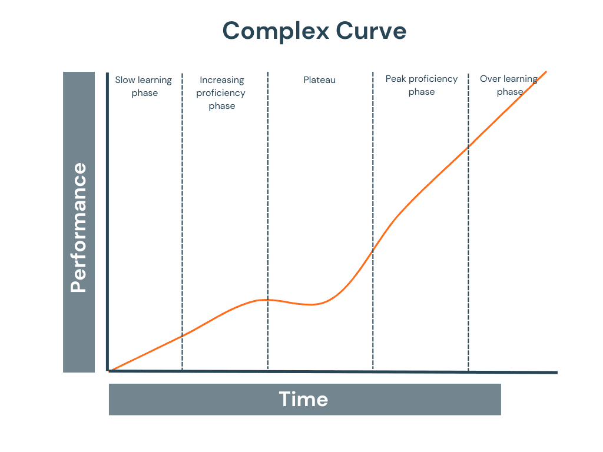

# iOS Development Learning Path: The Pareto Principle Approach

> Learn iOS development efficiently by focusing on the vital 20% first, then expanding to the advanced 80%.

{ width=300 height=300 }

## 📋 Table of Contents

- [The Philosophy](#the-philosophy)
- [Repository Structure](#repository-structure)
- [Learning Roadmap](#learning-roadmap)
- [The Pareto Principle in Practice](#the-pareto-principle-in-practice)
- [How to Use This Repository](#how-to-use-this-repository)
- [Progress Tracking](#progress-tracking)
- [Contributing](#contributing)
- [License](#license)

## 🧠 The Philosophy

### The Pareto Principle (80/20 Rule)

The Pareto Principle, also known as the 80/20 rule, suggests that roughly 80% of effects come from 20% of causes. Applied to learning iOS development:

- **20% of the Swift language and iOS frameworks** will enable you to build **80% of most common app functionalities**
- **20% of your learning time** focused on core concepts will yield **80% of your practical development skills**


### Why This Approach Works

Traditional approaches to learning iOS development often involve:
- Getting lost in documentation
- Learning features you rarely use
- Building unrealistic toy projects
- "Tutorial hell" without practical knowledge

Instead, this repository offers:
1. **Focus on the vital few** - Learn the 20% that matters most first
2. **Job-ready skills** - Prioritize what employers actually need
3. **Efficient learning path** - Clear progression from basics to advanced
4. **Project-based learning** - Apply knowledge immediately

## 📁 Repository Structure

This repository is organized into two main phases:

```
ios_fundamentals/
├── LICENSE
├── README.MD           <- You are here: Main overview and roadmap
├── phase-one/          <- The vital 20%
│   └── README.md       <- Core Swift and iOS fundamentals
└── phase-two/          <- The valuable 80%
    └── README.md       <- Advanced iOS development concepts
```

### Phase One: The Vital 20%

Phase One covers the core fundamentals that will enable you to build functional iOS applications. This includes:

- Basic Swift syntax and language features
- UIKit or SwiftUI fundamentals
- App navigation and lifecycle
- Basic networking and persistence
- Common design patterns

**Time estimate:** 4-8 weeks for a beginner

### Phase Two: The Valuable 80%

Phase Two expands into advanced topics that take your iOS development skills to professional level:

- Advanced Swift features (generics, protocols, etc.)
- Complex UI, animations, and custom controls
- Advanced architectures (MVVM, Coordinator, etc.)
- Performance optimization
- Specialized frameworks (ARKit, CoreML, etc.)

**Time estimate:** 6-12 months ongoing learning

## 🗺️ Learning Roadmap


### Stage 1: Swift Fundamentals (Weeks 1-2)
- Variables, types, and control flow
- Functions and closures
- Classes, structs, and enums
- Optionals and error handling

### Stage 2: iOS Basics (Weeks 3-5)
- UIKit/SwiftUI fundamentals
- View controllers and navigation
- UI controls and layouts
- App lifecycle

### Stage 3: Practical Skills (Weeks 6-8)
- Networking and API integration
- Data persistence
- Table/collection views
- Basic design patterns

### Stage 4: First App & Job Preparation (Weeks 9-10)
- Build a complete application
- Source control with Git
- Code review best practices
- Technical interview preparation

### Stage 5: Advanced Topics (Months 3-12)
- Custom UI components
- Complex architectures
- Performance optimization
- Specialized frameworks
- App Store submission

## 📊 The Pareto Principle in Practice

### Knowledge Distribution in iOS Development

| Category | % of Language/Framework | % of Practical Usage |
|----------|-------------------------|----------------------|
| Basic Swift | ~15% | ~40% |
| UIKit/SwiftUI Basics | ~10% | ~25% |
| Networking | ~5% | ~15% |
| Common Design Patterns | ~5% | ~10% |
| **Core Total (Phase One)** | **~20%** | **~80%** |
| Advanced Swift | ~20% | ~5% |
| Advanced UI | ~15% | ~5% |
| Specialized Frameworks | ~30% | ~5% |
| Performance Optimization | ~15% | ~5% |
| **Advanced Total (Phase Two)** | **~80%** | **~20%** |

### Skill Acquisition Timeline

```
Skill Level
^
|                                            /----- Expert
|                                      /-----
|                                /-----        <- Phase Two (80%)
|                          /-----
|                    /-----              
|              /-----                    <- Phase One (20%)
|       /-----
|------/
+----------------------------------------> Time
```

## 🚀 How to Use This Repository

### For Complete Beginners

1. Start with [Phase One README](./phase-one/README.md)
2. Complete each section in order
3. Build the recommended mini-projects
4. Take the self-assessment quizzes
5. Create your portfolio project
6. Move on to Phase Two when you can build basic apps independently

### For Developers Transitioning to iOS

1. Skim [Phase One README](./phase-one/README.md) to identify knowledge gaps
2. Focus on iOS-specific concepts you're unfamiliar with
3. Complete the practical exercises
4. Build a portfolio app combining your existing skills with iOS
5. Dive into [Phase Two README](./phase-two/README.md) based on your project needs

### For Job Seekers

1. Ensure you've mastered Phase One completely
2. Focus on interview-relevant topics from Phase Two
3. Build a polished portfolio app
4. Practice explaining technical concepts from both phases
5. Use the advanced topics from Phase Two for discussion points

## 📈 Progress Tracking

Track your progress through both phases with these milestones:

### Phase One Milestones

- [ ] Complete Swift syntax sections
- [ ] Build a basic UI with controls
- [ ] Implement navigation between screens
- [ ] Connect to a REST API
- [ ] Save and retrieve data locally
- [ ] Create a simple complete app

### Phase Two Milestones

- [ ] Implement custom UI components
- [ ] Use advanced architectural patterns
- [ ] Optimize app performance
- [ ] Integrate specialized frameworks
- [ ] Deploy to TestFlight/App Store

## 👥 Contributing

This learning path is designed to evolve with iOS development best practices. Contributions are welcome:

1. Fork the repository
2. Create your feature branch (`git checkout -b feature/amazing-improvement`)
3. Commit your changes (`git commit -m 'Add some amazing improvement'`)
4. Push to the branch (`git push origin feature/amazing-improvement`)
5. Open a Pull Request

## 📄 License

This project is licensed under the MIT License - see the [LICENSE](./LICENSE) file for details.

---

> "The vital few yield the majority of results; the trivial many consume the majority of resources." - Unknown

Start your iOS development journey the smart way - focus on the vital 20% first, then expand to the valuable 80%.