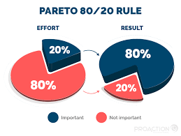
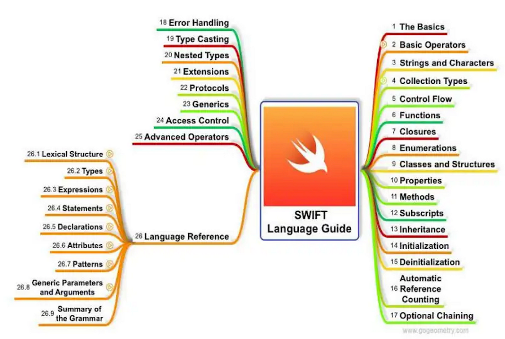

# iOS Development Learning Path: The Pareto Principle Approach

> My journey to learn iOS development efficiently - focusing on the vital 20% first, then expanding to the advanced 80%.


## Why I Created This Repository

After months of frustration trying to learn iOS development the traditional way - bouncing between tutorials, getting stuck in documentation rabbit holes, and building apps that never seemed finished - I hit a breaking point.

I was drowning in Swift syntax, UIKit peculiarities, and architectural patterns that seemed unnecessarily complex. Sound familiar?

Then it hit me: **I was trying to learn everything at once.**

What if, instead of attempting to master the entire iOS ecosystem before building anything useful, I focused on just the essential parts first? This revelation changed everything for me, and that's why I'm sharing this approach with you.

## 🧠 The Philosophy Behind My Approach

When I first discovered the Pareto Principle (the famous 80/20 rule), it was like finding a secret key. This principle suggests that roughly 80% of effects come from 20% of causes.

In my iOS learning journey, this translated to:

- **20% of Swift and iOS knowledge** lets me build **80% of the apps** I wanted to create
- The remaining 80% of concepts were only needed for specialized or highly optimized apps



Before this realization, I spent weeks stuck in "tutorial hell" - watching video after video without building anything substantial. I'd read about advanced protocols and generics before I could even comfortably create a simple table view.

**Does this sound like your experience too?** If so, you're not alone, and there's a better way.

## 📁 How This Repository Is Organized

I've structured this learning path based on what actually worked for me:

```
ios_fundamentals/
├── LICENSE
├── README.md           <- You're reading this now!
├── phase-one/          <- The vital 20% that gets you building real apps
│   └── README.md       <- Core Swift and iOS fundamentals
└── phase-two/          <- The valuable 80% for when you're ready to level up
    └── README.md       <- Advanced iOS development concepts
```

### Phase One: The Vital 20% That Changed Everything

This covers exactly what you need to start building functional apps that actually work. No fluff, no premature optimization, just the essentials:

- Swift basics that you'll use daily (not the obscure features)
- UI fundamentals that form the backbone of every app
- Navigation patterns used in 90% of iOS apps
- How to actually connect to APIs and save data (the practical way)

When I focused just on these core concepts, I went from feeling overwhelmed to shipping my first app in **just 6 weeks**. Before that, I had spent months learning without completing anything.

**Time estimate:** 4-8 weeks for most beginners (it took me 6)

### Phase Two: The Valuable 80% For When You're Ready

Once you're comfortable with the basics and have built a couple of simple apps, you can gradually explore these more advanced topics:

- Those fancy Swift features that make code more elegant
- Animations and custom UI that make your apps stand out
- Architecture patterns that help when your app grows beyond a few screens
- Performance tricks that matter when you have thousands of users

This is where the journey gets really fun because you're building on a solid foundation rather than trying to learn everything at once.

**Time estimate:** This becomes an ongoing learning journey

## 🗺️ My Recommended Learning Roadmap



Here's how I broke down my learning journey, and I suggest you might do the same:

### Stage 1: Swift Fundamentals (Weeks 1-2)
I spent the first two weeks just getting comfortable with Swift. Not advanced Swift, just the everyday stuff:
- Variables, types, and control flow (the bread and butter)
- Functions and closures (I use these constantly)
- Classes, structs, and enums (the building blocks)
- Optionals (I hated these at first, now I see their value)

### Stage 2: iOS Basics (Weeks 3-5)
This is where I started feeling like a real iOS developer:
- Building UIs (both with code and storyboards)
- Understanding the view controller lifecycle (this was a game-changer)
- Learning how to navigate between screens
- Figuring out how iOS apps actually "work"

### Stage 3: Practical Skills (Weeks 6-8)
This is where theory turned into actual useful apps:
- Connecting to real APIs (and handling all the messy parts)
- Saving data so it doesn't disappear when the app closes
- Mastering table views (they're everywhere in iOS apps)
- Understanding delegates and callbacks (I resisted these at first)

I vividly remember the moment when I connected all these pieces and built my first functioning weather app. It wasn't pretty, but it WORKED, and that feeling was incredible.

## 📊 The Reality of iOS Development Skills

Here's what I discovered about the actual distribution of knowledge in iOS development:

| What I Learned | Portion of Language | How Often I Use It |
|----------------|---------------------|---------------------|
| Basic Swift | ~15% | ~40% |
| UI Fundamentals | ~10% | ~25% |
| Networking Basics | ~5% | ~15% |
| Common Patterns | ~5% | ~10% |
| **Core Skills (Phase One)** | **~20%** | **~80%** |
| Advanced Swift | ~20% | ~5% |
| Complex UI | ~15% | ~5% |
| Specialized Frameworks | ~30% | ~5% |
| Optimization Techniques | ~15% | ~5% |
| **Advanced Skills (Phase Two)** | **~80%** | **~20%** |

This table reflects my daily reality as an iOS developer. I spend most of my time using a small subset of what I know.

## 🚀 How I Suggest Using This Repository

### If You're an Absolute Beginner (Like I Was)

1. Start with the [Phase One README](./phase-one/README.md) and follow it step-by-step
2. Don't skip ahead! I made this mistake and it cost me weeks
3. Build each mini-project along the way, even if they seem simple
4. When you hit roadblocks (and you will), join the discussions
5. Celebrate completing your first simple app - it's a huge milestone!

### If You're Transitioning From Another Platform

I came from web development, and these steps helped me:

1. Skim Phase One to identify iOS-specific concepts that are new to you
2. Pay special attention to the platform patterns that are different
3. Apply your existing programming knowledge to the new paradigms
4. Build something that leverages your previous experience
5. Then dive into Phase Two areas that align with your specialties

### For Anyone Already Hunting for iOS Jobs

When I was preparing for interviews, I focused on:

1. Making sure I had Phase One skills absolutely solid (they ask about these!)
2. Building one polished portfolio app I could talk about in depth
3. Practicing explaining how I structured my code and why
4. Learning just enough of the Phase Two concepts to sound knowledgeable
5. Being honest about what I knew and what I was still learning

## 📈 My Personal Progress Milestones

These are the exact milestones that helped me track my progress:

### Phase One Milestones

- [ ] Comfortable with Swift syntax (when you stop looking up basic things)
- [ ] Built a UI that doesn't look terrible
- [ ] Created an app with multiple screens
- [ ] Successfully pulled data from an API
- [ ] App doesn't lose data when closed
- [ ] First complete app you're not embarrassed to show friends

I still remember how accomplished I felt checking off each of these. The first time I pulled real data from an API and displayed it properly, I literally did a happy dance in my apartment.

## A Final Personal Note

Learning iOS development was one of the most frustrating AND rewarding experiences of my life. There were nights I wanted to throw my laptop out the window, and moments of pure joy when something finally clicked.

If you're feeling overwhelmed right now, I've been there. If you're wondering if you'll ever "get it," I promise there's a moment when the pieces start falling into place.

This repository represents the path I wish I had found when I started. I hope it helps you avoid some of the detours and frustrations I experienced.

Remember: focus on the vital 20% first, build something real, then expand your knowledge. You've got this!

---

> "I've never seen anyone truly fail at learning iOS development who kept building actual apps along the way." - My mentor who got me through the tough parts

If this approach helps you, or if you have questions along your journey, please reach out. This community made all the difference for me.
